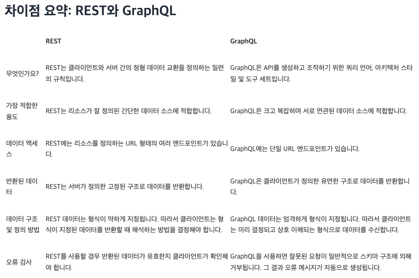

# 학습 키워드

## REST API 란 무엇인가?

### 정의

* REST 기반으로 서비스 API를 구현한 것
* 클라이언트와 서버 간의 두 컴퓨터 시스템이 인터넷을 통해 정보를 안전하게 교환하기 위해 사용하는 인터페이스
* 웹 서비스가 어떻게 동작해야 하는지에 대한 아키텍쳐 스타일 또는 설계 원칙

### 설계규칙

* 명사를 사용 / 동사는 사용하지 않는다.
* 소문자 사용
* 하이픈(-)은 가독성 높이는데 사용
* 밑줄(\_)은 사용하지 않는다.
* 파일 확장자 적지 않기

### 장점

* HTTP 프로토콜을 사용함으로 웹 브라우저 호환 용이
* 독립적이고 확장성이 높다.
* 자원 기반으로 URL 직관적이고 구조화

### 단점

* 상태가 없는 프로토콜이므로 매 요청마다 인증 정보 필요
* 복잡한 작업을 다루기엔 적합하지 않음

### 특징

* 다양한 서비스에 많이 사용되고 있어 다른 시스템 간의 상호 작용을 위한 효율적인 방법 제공

## GraphQL 란 무엇인가?

### 정의

* API를 생성하고 조직하기 위한 쿼리 언어, 아키텍셔 스타일 및 도구 세트
* 특정한 데이터베이스나 특정한 스토리지 엔진과 관계되어 있지 않으며 기존 코드와 데이터에 의해 대체

### 장점

* Schema를 정해 데이터의 일관성을 보장
* HTTP 요청 횟수를 줄일 수 있다.
* HTTP 응당 사이즈를 줄일 수 있다.
* 개발자들의 API 개발 부담을 덜 수 있다.

### 단점

* 고정된 요청과 응답만 필요할 때 query로 인해 요청의 크기가 Restful보다 커질 수 있다.
* 캐싱이 Restqhek qhrwkq
* 파일 업로드 구현 방법이 전행져있지 않아 직접 구현

### 특징

* 데이터 요청 박식의 효율성을 극대화
* 클라이언트와 서버간의 상호작용을 유연하게 만들어 줌
* 복잡한 데이터 요구사항이 있는 대규모 프로젝트에 사용 됨


## GraphQL은 왜 등장했는가?

* API 효율성과 유연성을 향상시키기 위해 등장
* 클라이언트가 데이터를 더 유연하고 정확하게 요청할 수 있게 함으로써 API의 효율성을 높이고, REST API의 한계를 해결하려는 목적으로 등장

## REST API vs GraphQL

<figure><figcaption></figcaption></figure>

## JSON

* 키-값 쌍으로 이루어진 데이터 오브젝트를 전달하기 위해 인간이 읽을 수 있는 텍스트를 사용하는 개방형 표준 포맷
* 백엔드에서 보통 REST API 또는 GraphQL을 활용하여 JSON 형태의 데이터를 돌려주는 API를 제공

## DSL(Domain-Specific Language)

### 정의

* 특정 도메인(산업, 분야등 특정 영역)에 특화된 언어

### 장점

* 반복이 제거되고 비슷한 처리 코드는 자동 생성
* 프로그래밍 코드의 양이 적고 가독성이 높음

### 단점

* 설계가 어려움
* 잘 설계되지 않은 코드는 읽기가 어려움
* 하위 호환성 유지

## 선언형 프로그래밍

* 프로그래밍의 데이터와 상태를 변경시키는 구문의 관점에서 연산을 설명하는 프로그래밍 패러다임의 일종
* 알고리즘을 명시하고 목표는 명시하지 않음

## 명령형 프로그래밍

* 프로그램이 어떤 방법으로 해야 하는지를 나타내기보다 무엇과 같은지를 설명
* 목표를 명시하고 알고리즘을 명시하지 않음

## SRP(단일 책임 원칙)

* 객체는 단 하나의 책임만 가져야 한다는 원칙
* 하나의 클래스는 하나의 기능 담당하여 하나의 책임을 수행하는데 집중되어야 있어야 한다
* 모듈이 변경되는 이유가 한가지 여야 함

### 장점

* 코드의 가독성
* 유지보수 용이
* 설계 원리들을 적용하는 기초

## Atomic Design

<figure><figcaption></figcaption></figure>

* 화학적 관점에서 영감을 얻은 디자인 시스템 방법론
* 작은 단위의 컴포넌트를 재사용성이 강하고, 단단하게 잘 설계함으로써 지속적으로 개발하기 용이

## React component 와 props

### React component

* UI를 재사용 가능한 개별적인 여러 조각으로 나누고, 각 조각을 개별적으로 볼 수 있음
* JavaScript 함수와 유사함
* “props”라고 하는 임의의 입력을 받은 후, 화면에 어떻게 표시되는지를 기술하는 React 엘리먼트를 반환

### props

* 속성, 특성이라는 뜻 / 객체
* 부모 컴포넌트가 자식 컴포넌트에게 전달하는 값
* 뭔가를 넘겨받을때, 자식 컴포넌트에서는 'props.이름' 으로 접근할 수 있다.

### props 특징

* 자식 컴포넌트에서 props는 읽기 전용
* 함수 컴포넌트, 클래스 컴포넌트 모두 컴포넌트의 자체 props를 수정할 수 없다.
* 부모 컴포넌트의 props를 변경하면, 해당 props를 사용하고 있던 자식 컴포넌트는 리렌더링 됨

### React component 와 props의 붕어빵 예시

* Component : 붕어빵 틀
* Element : 붕어빵
* props : 붕어빵 재료

## React state란?

* 리액트 Component의 상태
* 자바스크립트에서는 변수를 사용 / 리액트에서는 상태(state)를 사용
* State를 정의할 때 중요한 점은 꼭 렌더링이나. 데이터 흐름에 사용되는 것만 state에 사용해야 한다.

## DRY 원칙

* 중복을 피해라!
* 정보의 반복을 줄이는 것을 목표로 하는 소프트웨어 개발의 기본 원칙

### DRY 원칙을 준수해야하는 이유

* 코드가 단순해지며, 한번만 작성할 수 있다.
* 한 곳에서만 코드를 변하고 모든 인스턴스들에서는 변경사항만 확인할 수 있다.
* 시간과 노력이 절약되고 유지 관리가 쉬우며 버그 가능성도 줄어 든다.

### DRY 원칙을 준수하는 방법

* 코드와 로직을 재사용 가능한 더 작은 단위로 나누고 원하는 위치에 해당 코드를 호출하여 사용
* 비즈니스룰, 긴 표현식, if 문, 수학적 함수, 메타데이터 등을 한 곳에 넣기

## SSOT(Single Source of Truth)

* 정보 모형과 관련된 데이터 스키마를 모든 데이터 요소를 한 곳에서만 제어 또는 편집하도록 조직하는 관례
* 데이터베이스, 애플리케이션, 프로세스 등의 모든 데이터에 대해 하나의 출처를 사용하는 개념
* 데이터 일관성, 신뢰성, 효율성을 보장하는 중요한 개념
* 데이터와 정보를 이해하고 표준화하며, 출처를 지정하고 데이터 관리 규정을 작성
* 데이터 관리의 복잡성을 줄이고 효율적인 업무 프로세스를 구축

## useState

* 컴포넌트에 state 변수를 추가할 수 있는 React Hook

### 래퍼런스

* 컴포넌트의 최상위 레벨에서 useState를 호출하여 state 변수를 선언

```
import { useState } from 'react';

function MyComponent() {
  const [age, setAge] = useState(28); // age : 현재 state | setAge : 초기 state
  // ...
```

## 1급 객체(first-class object)란?

* 다른 객체들에 일반적으로 적용 가능한 연산을 모두 지원하는 객체
* 변수에 할당(assignment)할 수 있다.
* 다른 함수를 인자(argument)로 전달 받는다.
* 다른 함수의 결과로서 리턴될 수 있다.
* 함수를 데이터(string, number, boolean, array, object) 다루듯이 다룰 수 있다.

## Lifting State Up

* 상태 끌어올리기
* 상태를 자식 컴포넌트에서 부모 컴포넌트로 이동시키는 것
* 두 개 이상의 자식 컴포넌트가 동일한 데이터를 공유해야 할 때 사용
