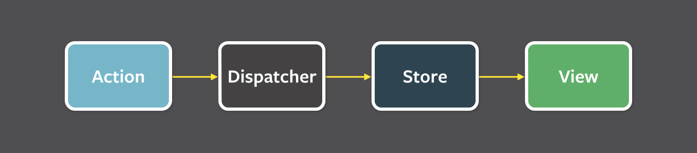

# External Store

Separation of Concerns

[관심사의 분리](https://ko.wikipedia.org/wiki/%EA%B4%80%EC%8B%AC%EC%82%AC_%EB%B6%84%EB%A6%AC)

Layered Architecture에선 사용자에게 가까운 것과 사용자에게서 먼 것으로 구분

1. Input: 프로그램 시작
2. Process: 프로그램 초기화
3. Output: 사용자에게 초기 UI 보여주기
4. Input: 사용자의 입력
5. Process: 사용자의 입력에 따라 처리
6. Output: 처리 결과 보여주기
7. Input: 사용자의 또 다른 입력
8. …반복…

## Flux Architecture

[Flux](https://facebook.github.io/flux/docs/in-depth-overview/)

[Flux (한국어)](https://haruair.github.io/flux/docs/overview.html)

[Redux의 핵심](https://ko.redux.js.org/tutorials/essentials/part-1-overview-concepts)

단방향 데이터 흐름

<figure><figcaption><p>구조와 데이터 흐름 (단방향 데이터 흐름)</p></figcaption></figure>

1. Action → 이벤트/메시지 같은 객체.
2. Dispatcher → (여러) Store로 Action을 전달. 메시지 브로커와 유사하다.
3. Store (여러 개) → 받은 Action에 따라 상태를 변경. 상태 변경을 알림.
4. View → Store의 상태를 반영.한방향 데이터 흐름

### Redux

<figure><figcaption><p>한방향 데이터 흐름</p></figcaption></figure>

1. Action
2. Store → dispatch를 통해 Action을 받고, 사용자가 정의한 reducer를 통해 State를 변경한다.
3. View → State를 반영.

### Action

* Input → Action + dispatch
* Process → reducer
* Output → View(React)

## External Store&#x20;

[forceUpdate와 같은것이 있습니까?](https://ko.legacy.reactjs.org/docs/hooks-faq.html#is-there-something-like-forceupdate)


## useReducer

강제 랜더링

### 예시 1

```jsx
import { useEffect, useReducer } from 'react';

let count = 0;

export default function Counter() {
  const [ignored, forceUpdate] = useReducer((x) => x + 1, 0);

  useEffect(() => {
    console.log(count);
  });

  const handleClick = () => {
    count += 1;
    // 강제 랜더링
    forceUpdate();
  };
  return (
    <div>
      <p>{count}</p>
      <button type="button" onClick={handleClick}>클릭</button>
    </div>
  );
}
```

### 예시2

```jsx
import { useEffect, useReducer } from 'react';

let count = 0;

function reducer(state) {
    return { ...state, x: state.x + 1 };
}

export default function Counter() {
  const [, forceUpdate] = useReducer(reducer, { x: 0 });

  useEffect(() => {
    console.log(count);
  });

  const handleClick = () => {
    count += 1;
    // 강제 랜더링
    forceUpdate();
  };
  return (
    <div>
      <p>{count}</p>
      <button type="button" onClick={handleClick}>클릭</button>
    </div>
  );
}
```

### 예시3

Counter.tsx

```jsx
import useForceUpdate from "../hooks/useForceUpdate";

let count = 0;

export default function Counter() {
  const forceUpdate = useForceUpdate();

  const handleClick = () => {
    count += 1;
    forceUpdate();
  };
  return (
    <div>
      <p>{count}</p>
      <button type="button" onClick={handleClick}>클릭</button>
    </div>
  );
}
```

hooks/useForceUpdate.ts

```jsx
import { useState } from 'react';

export default function useForceUpdate() {
  const [state, setState] = useState(0);

  const forceUpdate = () => {
    setState(state + 1);
  };
  return forceUpdate;
}
```

### 예시4

Counter.tsx

```jsx
import useForceUpdate from "../hooks/useForceUpdate";

const state = {
  count: 0,
};

export default function Counter() {
  const forceUpdate = useForceUpdate();

  const handleClick = () => {
    state.count += 1;
    forceUpdate();
  };
  return (
    <div>
      <p>{state.count}</p>
      <button type="button" onClick={handleClick}>클릭</button>
    </div>
  );
}
```

## 예시5

hooks/useForceUpdate.ts

```jsx
import { useState } from 'react';

export default function useForceUpdate() {
  const [, setState] = useState({});

  const forceUpdate = () => setState({});

  return forceUpdate;
}
```

### 예시6

**`useCallback`**

```jsx
import { useState, useCallback } from 'react';

export default function useForceUpdate() {
  const [, setState] = useState({});

  return useCallback(() => setState({}), []);
}
```
